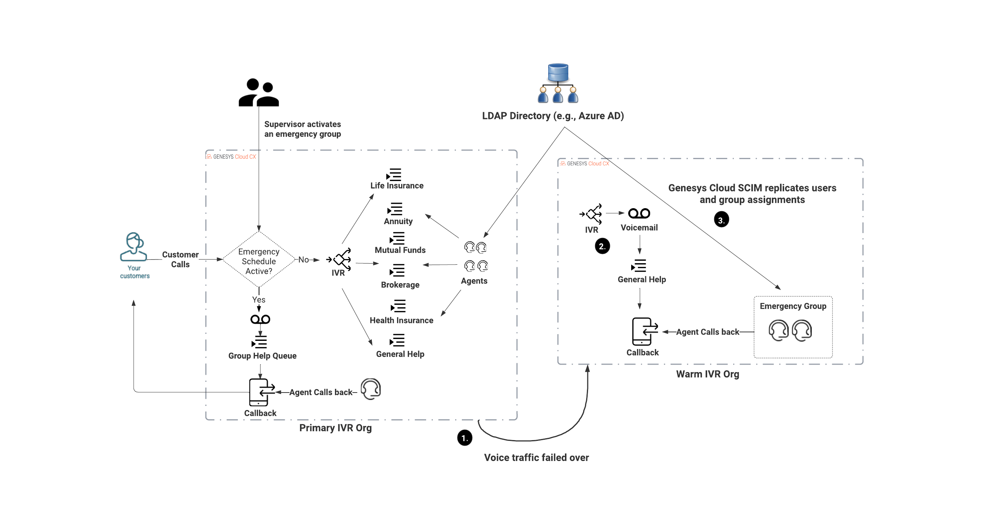

# Build resiliency in your IVR with Genesys Cloud emergency groups and callbacks

> View the full [Build resiliency in your IVR with Genesys Cloud emergency groups and callbacks](https://developer.mypurecloud.com/blueprints/) blueprint on the Genesys Cloud Developer Center. This Genesys Cloud Developer Blueprint explains how to build a resilient IVR by leveraging emergency groups to control IVR behavior within a single Genesys Cloud organization and build a "warm" IVR solution that can be used when there is a regional outage in a Genesys Cloud organization and you need to process voice traffic in another Genesys Cloud region.

This Genesys Cloud Developer Blueprint explains how to use GitHub Actions to deploy both examples of a resilient IVRs to two different Genesys Cloud organizations.

This blueprint also demonstrates how to:

* Set up a GitHub Action CI/CD pipeline to execute a CX-as-Code deployment
* Configure Terraform Cloud to manage the backing state for the CX-as-Code deployment along with the lock management for the Terraform deployment

